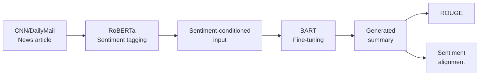

# Sentiment-Controlled News Summarisation with BART

Fine-tuning BART for sentiment-controlled abstractive summarisation of news articles, with evaluation of both content quality and sentiment preservation.


## Overview

Standard abstractive summarisation optimises for content overlap with a reference summary. News articles, however, also carry an emotional orientation. An article's tone can be preserved, flattened, or shifted in the process of summarising it. This project treats sentiment as an explicit generation constraint: BART is fine-tuned on inputs where source text is tagged with its sentiment, and the resulting model is compared against the untouched base model on both standard content metrics and a purpose-built sentiment-alignment score.

## Research Question

> **Can a BART summarisation model be conditioned on the sentiment of an article, and does this improve sentiment preservation without substantially degrading summarisation quality?**

The interesting result here is not a universal win. The experiment surfaces a trade-off between sentiment preservation and conventional content-overlap metrics. That trade-off, and the reasoning behind it, is the main finding of this project.

## Approach



## Dataset

[CNN/DailyMail](https://huggingface.co/datasets/abisee/cnn_dailymail) (version 3.0.0) was used, for two reasons: it's a standard abstractive summarisation benchmark, and `facebook/bart-large-cnn` was already pretrained on it, which makes it a demanding baseline to condition against (see [Baseline vs. Conditioned Model](#baseline-vs-conditioned-model) below).

The experiment uses a **2,000-example training slice and a 200-example validation slice**, not the full dataset (which has ~287K training examples). This is a computational choice for a single free-tier GPU session, not a claim about dataset scale. Please see [Limitations](#limitations).

## Sentiment Conditioning

Sentiment conditioning is implemented entirely through input representation and fine-tuning as BART has no built-in sentiment mechanism.

1. **Labelling.** Each article is split into sentences with NLTK and grouped into chunks of 3 paragraphs.
2. **Classification.** Each chunk is scored by [`cardiffnlp/twitter-roberta-base-sentiment-latest`](https://huggingface.co/cardiffnlp/twitter-roberta-base-sentiment-latest), a 3-class sentiment classifier.
3. **Tagging.** Each chunk is prefixed with its predicted label as a literal token: `[NEGATIVE]`, `[NEUTRAL]`, or `[POSITIVE]`.
4. **Tokenizer extension.** These labels are registered as additional special tokens, and BART's embedding matrix is resized so it learns dedicated embeddings for them, rather than having them split into arbitrary sub-word pieces.
5. **Fine-tuning.** Finally, BART is trained to map the tagged input to the (untagged) reference summary, so it learns to use the tags as generation signal.

Example of a tagged input, drawn from this project's own qualitative test:

```text
[NEGATIVE] A major security flaw was found in global banking networks today, letting hackers
compromise thousands of accounts. Financial authorities confirmed millions of dollars were
drained from vulnerable infrastructure before teams could react. Panic spread quickly across
social media as users found themselves locked out of their primary savings applications.
[NEUTRAL] Officials stated they are launching an urgent task force alongside cyber security
experts to locate vulnerabilities. ...
[POSITIVE] Fortunately, tech developers successfully isolated the exploit path, confirming no
structural records were corrupted. ...
```

## Model & Training

| Component            | Details                                                      |
|-----------------------|---------------------------------------------------------------|
| Base model            | `facebook/bart-large-cnn`                                     |
| Task                  | Abstractive summarisation                                     |
| Conditioning          | Sentiment labels ([NEGATIVE]/[NEUTRAL]/[POSITIVE], added as special tokens) |
| Sentiment classifier  | `cardiffnlp/twitter-roberta-base-sentiment-latest`             |
| Dataset               | CNN/DailyMail (3.0.0)                                          |
| Training examples     | 2,000                                                          |
| Validation examples   | 200                                                             |
| Test examples (eval)  | 10                                                              |
| Framework             | PyTorch / Hugging Face Transformers & Datasets                |
| Max input length      | 1,024 tokens                                                    |
| Max target length     | 256 tokens                                                      |
| Epochs                | 1                                                                |
| Learning rate         | 3e-5                                                             |
| Batch size            | 4 per device, gradient accumulation 2 (effective batch size 8) |
| Precision             | fp16 (mixed precision) where a GPU is available                |
| Hardware              | Google Colab, free-tier T4 GPU                                  |
| Evaluation            | ROUGE-1/2/L/Lsum + sentiment alignment                          |

## Baseline vs. Conditioned Model

The experiment compares two models against the same 10 held-out test articles:

- **Baseline:** the plain `facebook/bart-large-cnn` — no additional training.
- **Sentiment-conditioned model:** the same base weights, fine-tuned on sentiment-tagged CNN/DailyMail input as described above.

**Why compare against the untouched base model, and not a plain fine-tuned one?** `facebook/bart-large-cnn` is already pretrained specifically on CNN/DailyMail. An earlier experiment in this repo (`bart_finetuning.py`) fine-tuned it again on the same dataset, and that *lowered* ROUGE relative to the untouched base model, further fine-tuning on a small slice of data the model has already seen mostly just adds overfitting, not improvement. That negative result is the reason the untouched base model, not another fine-tuned checkpoint, is the fair comparison point for isolating what sentiment conditioning specifically contributes.

## Results

| Metric              | Base BART | Sentiment-conditioned |
|----------------------|----------:|-----------------------:|
| ROUGE-1              |     0.407 |                  0.394 |
| ROUGE-2              |     0.197 |                  0.184 |
| ROUGE-L              |     0.311 |                  0.302 |
| ROUGE-Lsum           |     0.342 |                  0.360 |
| Sentiment alignment  |     0.899 |                  0.946 |

Sentiment alignment improves meaningfully under conditioning, while ROUGE-1/2/L show a small decrease and ROUGE-Lsum shows a small increase. The conditioning mechanism appears to strengthen sentiment preservation, but this comes with mixed effects on conventional summarisation metrics. In other words, it's neither a clean win nor a failure, but a measurable trade-off between two different notions of summary quality.

## Qualitative Examples

### Example 1

**Source** (abridged)

> A major security flaw was found in global banking networks today, letting hackers compromise thousands of accounts... Officials stated they are launching an urgent task force... Fortunately, tech developers successfully isolated the exploit path... Stocks rebounded dramatically late in the afternoon following news of the comprehensive rescue plan.

**Sentiment-conditioned BART**

> Major security flaw found in global banking networks today, letting hackers compromise thousands of accounts. Millions of dollars were drained from vulnerable infrastructure before teams could react. The central reserve announced it will provide temporary collateral support to impacted local credit networks. Engineers believe that patch configurations can be finalized and pushed safely by tomorrow morning.

**Observation:** the summary draws from the tagged negative and neutral segments but omits the tagged positive segment (the resolution / stock rebound) entirely. Sentiment conditioning shifts model behaviour in aggregate, but doesn't guarantee every tagged segment is represented in a given output. See [Limitations](#limitations).

*Only one example is included here; more would be added by sampling further outputs from `evaluate.ipynb`.*

## Evaluation

**Content quality — ROUGE.** ROUGE-1/2 measure unigram/bigram overlap with the reference summary; ROUGE-L and ROUGE-Lsum measure longest common subsequence overlap. These are standard summarisation metrics but only capture lexical overlap, not semantic correctness.

**Sentiment preservation — sentiment alignment.** For a given text, it's split into paragraphs, each is scored by the same RoBERTa sentiment classifier used for tagging, and the resulting probability vectors (negative/neutral/positive) are averaged into one vector per text. Sentiment alignment is the **cosine similarity** between the source article's vector and the generated summary's vector, ranging from -1 (opposite sentiment) to 1 (identical sentiment profile). It is a similarity score, not an accuracy metric as it says nothing about factual correctness, only about whether the emotional tone was preserved.

## Reproducibility

Requires a GPU (developed and tested on Colab's free-tier T4).

```text
clone repository
        ↓
pip install -r requirements.txt
        ↓
run sentiment_tagging.ipynb        (builds data/tagged_train_nltk, data/tagged_val_nltk)
        ↓
run bart_sentiment_finetuning.py   (produces models/bart_sentiment_controlled)
        ↓
run evaluate.ipynb                 (produces the Results table above)
```

```bash
git clone <repo-url>
cd Quick-summary
pip install -r requirements.txt
```

Then, in order:

1. Run `sentiment_tagging.ipynb` top to bottom.
2. Run `bart_sentiment_finetuning.py` (e.g. `python bart_sentiment_finetuning.py`). If `data/` or `models/bart_base_cnn` don't exist yet, the script builds/downloads them itself.
3. Run `evaluate.ipynb` top to bottom to reproduce the Results table.

## Project Structure

```text
Quick-summary/
├── data/                          # tagged datasets (generated, not committed)
│   ├── tagged_train_nltk/
│   └── tagged_val_nltk/
├── models/                        # trained weights (generated, not committed)
│   ├── bart_base_cnn/
│   └── bart_sentiment_controlled/
├── sentiment_utils.py
├── sentiment_tagging.ipynb
├── bart_sentiment_finetuning.py
├── bart_finetuning.py
├── evaluate.ipynb
├── requirements.txt
├── .gitignore
└── README.md
```

| File                            | Purpose                                                                 |
|----------------------------------|--------------------------------------------------------------------------|
| `sentiment_utils.py`             | Shared module: sentiment tagging and sentiment-alignment scoring. Used by both the data-prep and evaluation stages, so the tagging logic used at training time and inference time can't drift apart. |
| `sentiment_tagging.ipynb`        | Builds the sentiment-tagged training/validation data from CNN/DailyMail. |
| `bart_sentiment_finetuning.py`   | Fine-tunes BART on the sentiment-tagged data; self-sufficient (tags data / downloads the base model if either is missing locally). |
| `bart_finetuning.py`             | Earlier experiment: plain fine-tuning on CNN/DailyMail with no conditioning. Kept as a documented negative result (see [Baseline vs. Conditioned Model](#baseline-vs-conditioned-model)), not part of the active pipeline. |
| `evaluate.ipynb`                 | Compares the base and sentiment-conditioned models: ROUGE, sentiment alignment, and qualitative examples. |

Reusable logic (sentiment tagging, alignment scoring) is kept in a standalone module rather than duplicated across notebooks; data preparation, training, and evaluation are kept as separate, independently runnable stages.


## Limitations

- **Small experimental scale.** Training used 2,000 examples for 1 epoch; evaluation used only 10 test articles. The reported numbers indicate a direction, not a statistically robust estimate.
- **A strong, non-neutral baseline.** `facebook/bart-large-cnn` is already pretrained on CNN/DailyMail, so "beating the base model" is a high bar, and any comparison here is against a model already specialised for this exact data.
- **Sentiment labels depend on one classifier.** All tags (training and evaluation) come from a single RoBERTa sentiment model; its own errors or biases propagate directly into both the training signal and the evaluation metric.
- **ROUGE captures lexical overlap, not meaning.** It does not measure factual correctness or semantic quality.
- **Sentiment alignment is not a correctness measure.** A summary can have a high alignment score while being factually wrong or incoherent.
- **Uneven tag representation.** As shown in the qualitative example above, the conditioned model doesn't reliably represent every tagged sentiment segment in its output. Conditioning shifts aggregate behaviour without guaranteeing per-example coverage.

## Key Takeaways

- Transformer fine-tuning can introduce additional control signals into abstractive summarisation beyond the original task objective.
- Explicit sentiment conditioning, implemented via tagged inputs and extended special tokens, produces a measurable increase in sentiment alignment.
- That improvement comes with mixed, not purely negative, effects on conventional content-overlap metrics.
- Evaluating a controllable-generation system needs both a standard metric (ROUGE) and a metric specific to the added control dimension (sentiment alignment), either alone tells an incomplete story.

## Future Work

- Evaluate on a dataset outside BART's original pretraining distribution (e.g. XSum), to separate "conditioning effect" from "re-exposure to already-seen data."
- Train on a larger slice / more epochs to see whether the ROUGE gap narrows or widens.
- Compare alternative sentiment classifiers, to check how much the results depend on this specific one.
- Add a semantic/factuality metric (e.g. BERTScore) alongside ROUGE.
- Expose the trained model through a small FastAPI endpoint for interactive testing.